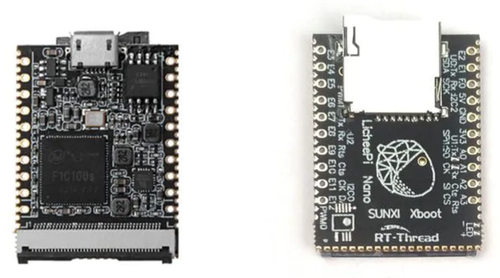
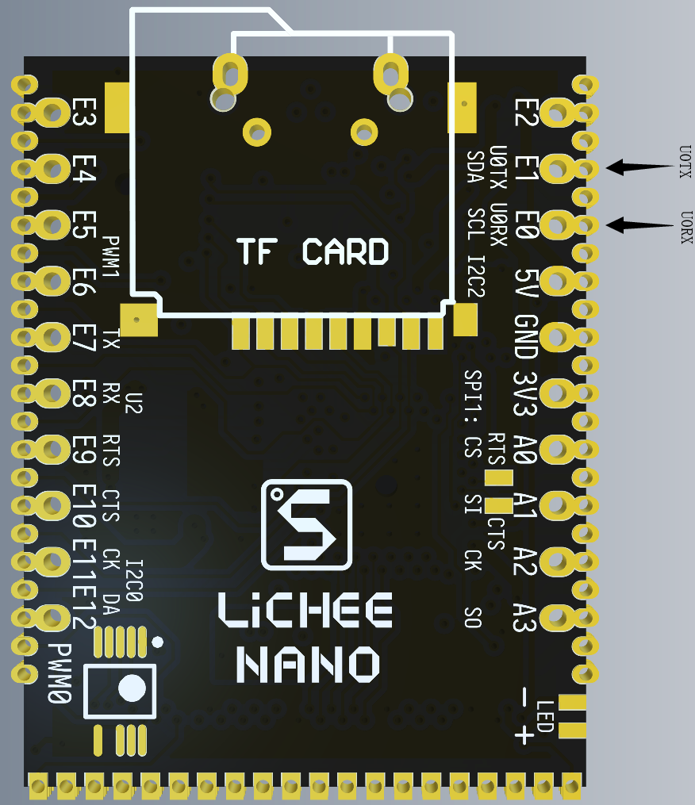
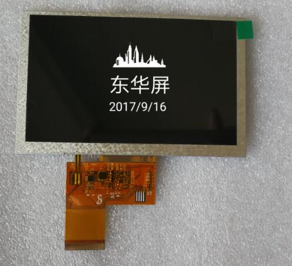

# meta-licheepinano

## Instruction how to build an image for Lichee Pi Nano in Yocto

### Products:

  
Lichee Pi Nano Version  
 

Lichee Pi Nano Pinout  
  

Lichee Pi Nano dedicated LCD Display model sh050jgb30  
  

## General Note:
Assumed that Linux Ubuntu is installed

## List of tested elements
Example application for GPIO handling

## List of not tested elements
Lcd  
Touchscreen  

TBD  

## How to build an images

1. First make sure to following packages are installed in system

    ***sudo apt-get install gawk wget diffstat unzip texinfo gcc-multilib build-essential chrpath socat libsdl1.2-dev xterm emscripten libmpc-dev libgmp3-dev***

    **Note:**
    More informations can be found on Yocto reference manual.

2. Download necessary Yocto packaged listed below. Be sure to be in root of home folder.

	***mkdir yocto*** 
	***cd yocto***  
	***mkdir build***  
	***git clone git://git.yoctoproject.org/poky --depth 1 -b dunfell***  
        ***cd poky***  
	***git clone git://git.openembedded.org/meta-openembedded --depth 1 -b dunfell***  
	***git clone https://github.com/meta-qt5/meta-qt5.git --depth 1 -b dunfell***  
	***git clone https://github.com/voloviq/meta-licheepinano --depth 1 -b dunfell***  

3. Select directory to build Linux

    Nano version  
	***source oe-init-build-env ~/yocto/build/licheepinano***  

4. Modify bblayers.conf(located in ~/yocto/build/licheepinano/conf)

    *BBLAYERS ?= " \\\
      ${HOME}/yocto/poky/meta \\\
      ${HOME}/yocto/poky/meta-poky \\\
      ${HOME}/yocto/poky/meta-openembedded/meta-oe \\\
      ${HOME}/yocto/poky/meta-openembedded/meta-networking \\\
      ${HOME}/yocto/poky/meta-openembedded/meta-python \\\
      ${HOME}/yocto/poky/meta-qt5 \\\
      ${HOME}/yocto/poky/meta-licheepinano \\\
      "* 

    **Note:** Please adapt PATH of conf/bblayers.conf if necessary.  

5. Modify local.conf(located in ~/yocto/build/licheepinano/conf) file

    - modify line with "MACHINE ??" to add "licheepinano-sdcard" or for SPI NOR Flash "licheepinano-spinor"

    - align *DL_DIR = "${HOME}/yocto/downloads"*  

    - align *SSTATE_DIR = "${HOME}/yocto/sstate-cache"*  
    
    - align *TMPDIR = "${HOME}/yocto/tmp"*  
    
    - add at the end following records    
    	*RM_OLD_IMAGE = "1"*  
	    *INHERIT += "rm_work"*  
    - for spi flash change DISTRO ?= "poky" to DISTRO ?= "licheepinano-tiny"  

    **Note:** Please adapt rest of conf/local.conf parameters if necessary.  

6. Build objects

    - When using SPI NOR Flash use following image
    - core image minimal  
      ***bitbake core-image-minimal***  

    - console image  
      ***bitbake console-image***  

    - qt5 image  
      ***bitbake qt5-image***  

    - qt5 toolchain sdk  
      ***bitbake meta-toolchain-qt5***  

7. After compilation images appears in

    Nano version  
	*~/yocto/tmp/deploy/images/licheepinano*  

8. Insert SD CARD into dedicated CARD slot and issue following command to write an image

    **Note:**  
    Be 100% sure to provide a valid device name (**of=/dev/sde/mmcblk0**). Wrong name "/dev/sde/mmcblk0" dameage Your system file !    
        Nano version  
    	***sudo dd if=~/yocto/tmp/deploy/images/licheepinano-sdcard/core-image-minimal-licheepinano-sdcard.sunxi-sdimg of=/dev/mmcblk0 bs=1024***  

9. SPI NOR Flash update tool compilation(if valid sunxi-tools installed go to point 10) 
    ***git clone https://github.com/Icenowy/sunxi-tools.git -b f1c100s-spiflash*** 
    ***sudo apt-get install libz libusb-1.0-0-dev*** 
    ***make*** 
    ***sudo make install*** 

10. Flash SPI NOR flash 
    ***sunxi-fel -p spiflash-write 0 ~/yocto/tmp/deploy/images/licheepinano-spinor/core-image-minimal-licheepinano-spinor.sunxi-spinor*** 

11. How to handle GPIO from userfs - example (used PE3 as GPIO) 

    1. Take a GPIO for instance PE3 
    ***echo 131 > /sys/class/gpio/export*** 
    2. Set as out or in 
    ***echo "out" > /sys/class/gpio/gpio131/direction*** 
    3. Set GPIO state if configured as ouput 
    ***echo 1 > /sys/class/gpio/gpio131/value*** 
    ***echo 0 > /sys/class/gpio/gpio131/value*** 
    
# Limitation
	
